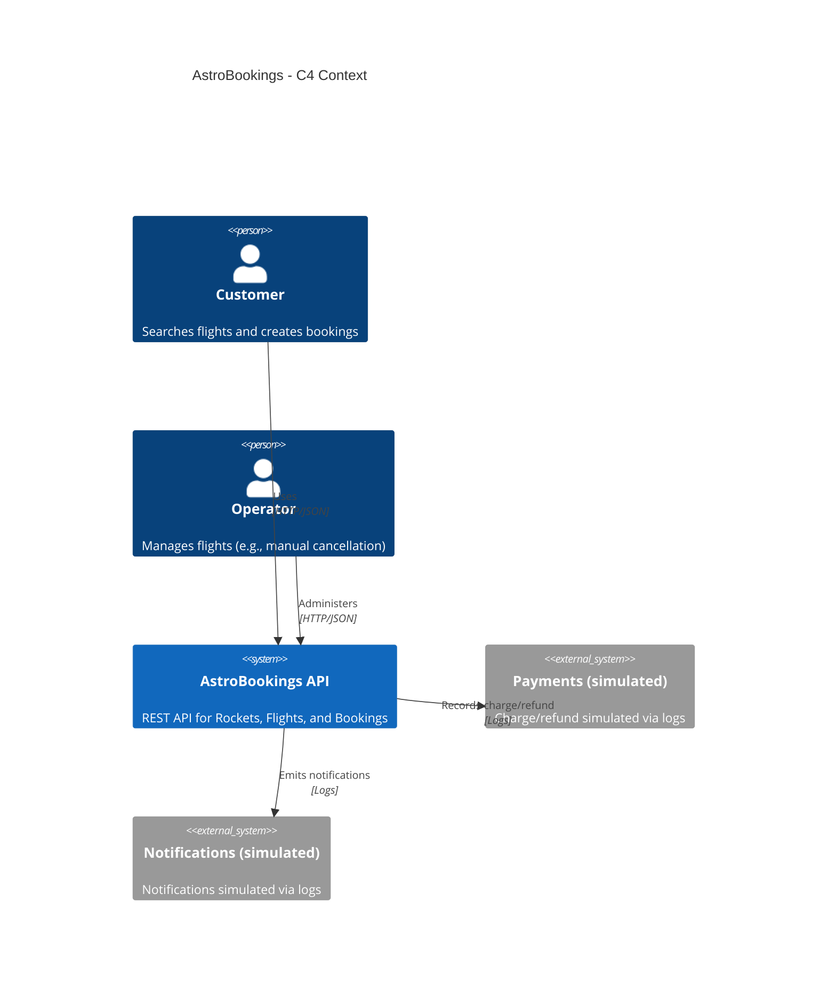

# AstroBookings P.R.D.

Product Requirements Document for AstroBookings

## Overview

**AstroBookings** aims to provide a backend REST API for managing space travel reservations, covering rockets, flights, and bookings with capacity controls, pricing/discount rules, and flight state management.

### Goals

- Provide a minimal, workshop-friendly REST API for `Rocket`, `Flight`, and `Booking`.
- Enforce business rules (validation, capacity, discounts, and state transitions) consistently.
- Keep implementation lightweight (in-memory persistence, no security, simulated payments/notifications via logs).

### Context diagram

## Functional Requirements

### FR1 Rocket creation and lookup

The API must support creating and retrieving `Rocket` resources.

- Create `Rocket` with validation.
- List all `Rocket`.
- Get `Rocket` by `id`.
- Validation rules:
	- `name` is required and must be non-empty.
	- `capacity` is required and must be between 1 and 10.
	- `speed` is optional.
	- `range` is optional and, when present, must be one of: `LEO`, `MOON`, `MARS`.

### FR2 Flight creation

The API must support creating `Flight` resources with business validation.

- `launchDate` must be in the future.
- `basePrice` must be > 0.
- `minPassengers` defaults to 5 when omitted.
- Initial `Flight` state is `SCHEDULED`.

### FR3 List future flights

The API must allow listing future `Flight` resources.

- List flights whose `launchDate` is in the future.
- Provide filtering by flight `state` (at least for the states defined below).

### FR4 Booking creation with constraints

The API must support creating `Booking` resources for a given `Flight`.

- Booking must include passenger details: `name` and `email` (both required).
- Booking must reference an existing `Flight`.
- Booking is only allowed when the flight is not `SOLD_OUT` and not `CANCELLED`.
- Booking must not exceed the assigned rocket capacity; when capacity is reached, the flight becomes `SOLD_OUT`.

### FR5 Booking lookup by flight

The API must support retrieving bookings by `Flight`.

- List and/or query `Booking` resources associated to a given `Flight`.

### FR6 Discount rules (single discount, precedence)

The system must compute and persist/return a `finalPrice` for each booking by applying exactly one discount according to precedence:

1. Last seat (booking that fills rocket capacity): 0%.
2. One seat away from reaching `minPassengers`: 30%.
3. All other bookings: 10%.

### FR7 Flight states and automatic transitions

The system must manage `Flight` states and transition them according to booking volume and time-based rules.

- States: `SCHEDULED`, `CONFIRMED`, `SOLD_OUT`, `CANCELLED`, `DONE`.
- When passenger count reaches `minPassengers` → state becomes `CONFIRMED` and a notification is simulated via logs.
- When passenger count reaches rocket capacity → state becomes `SOLD_OUT`.
- If within 1 week of launch and `minPassengers` not met → state becomes `CANCELLED`, simulate notification and refund via logs.
- When the flight is performed → state becomes `DONE`.

### FR8 Manual flight cancellation

The system must allow manually cancelling a flight.

- Operator can set flight to `CANCELLED`.
- Cancelled flights do not accept new bookings.
- Simulate notifications/refunds via logs.

### FR9 Error handling

The API must provide consistent error responses for invalid input and rule violations.

- `400 Bad Request` for payload/validation errors.
- `404 Not Found` for missing resources.
- `409 Conflict` (or equivalent) for capacity/state rule violations.

## Technical Requirements

### TR1 Layered architecture

Maintain a layered architecture (presentation/business/persistence) with clear responsibilities.

### TR2 REST + JSON

Expose a RESTful API with JSON request/response bodies and appropriate HTTP status codes.

### TR3 In-memory persistence

Use in-memory repositories/collections; no database is required.

### TR4 Minimal dependencies

Keep dependencies minimal; suitable for workshop/training usage.

### TR5 Simulated integrations

Payments and notifications are simulated with logs (no external integrations required).

### TR6 Time-based rules support

Time-based rules (future launch validation and 1-week-to-launch cancellation threshold) must be implemented using a consistent time source to keep behavior deterministic.

> End of PRD for AstroBookings, last updated on 2025-12-15.
