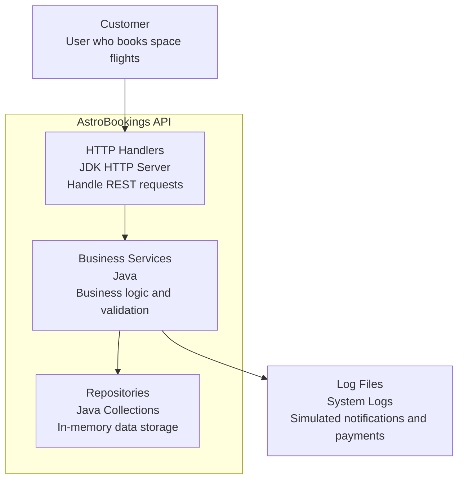

# AstroBookings STRUCTURE

Structure Document for AstroBookings

## Overview

**AstroBookings** is a layered (n-tier) architecture, designed for maintainability, separation of concerns, and educational clarity, using Java with native JDK HTTP server for minimal dependencies and in-memory data management.

## Architecture

The system follows a classic layered architecture with clear separation of concerns:

- **Presentation Layer**: HTTP handlers using JDK's built-in HTTP server for REST endpoints.
- **Business Layer**: Service classes containing business logic, validation, and orchestration.
- **Persistence Layer**: In-memory repositories using Java collections for data storage.

Key principles:
- Clear separation of concerns between layers.
- Minimal dependencies (only Jackson for JSON, JUnit for testing).
- No Spring Boot, database, or security (for demo/training purposes).
- All state and logic are managed in-memory using Java collections.
- Simulated external integrations (logs for notifications/payments).

### Folder Structure

Main folders and their purposes:

```
src/main/java/academy/aicode/astrobookings/
├── AstrobookingsApplication.java    # Main entry point, HTTP server setup
├── presentation/                    # HTTP handlers for REST endpoints
│   ├── BaseHandler.java            # Common handler functionality
│   ├── RocketHandler.java          # Rocket CRUD operations
│   ├── FlightHandler.java          # Flight management
│   └── BookingHandler.java         # Booking operations
├── business/                        # Business logic and validation
│   ├── RocketService.java          # Rocket business operations
│   ├── FlightService.java          # Flight state management
│   └── BookingService.java         # Booking logic with discounts
└── persistence/                     # Data access layer
    ├── RocketRepository.java       # In-memory rocket storage
    ├── FlightRepository.java       # In-memory flight storage
    ├── BookingRepository.java      # In-memory booking storage
    └── models/                      # Domain entities
        ├── Rocket.java             # Rocket entity
        ├── Flight.java             # Flight entity
        └── Booking.java            # Booking entity
```

### Rocket Management

This project includes a simple Rocket Management feature implementing REST endpoints and validation rules.

- **Endpoints:**
    - `POST /rockets` — create a new rocket (returns 201 and the created resource).
    - `GET /rockets` — list rockets (supports optional `name` query filter).
    - `GET /rockets/{id}` — fetch a rocket by id (returns 200 or 404).

- **Validation rules:**
    - `name` is required and must be non-blank.
    - `capacity` is required and must be an integer between 1 and 10.
    - `range` is optional and must be one of `LEO`, `MOON`, `MARS`.
    - `speed` is optional (double).

- **Data transfer objects (DTOs):**
    - Request DTO: `src/main/java/academy/aicode/astrobookings/presentation/dto/CreateRocketRequest.java`
    - Response DTO: `src/main/java/academy/aicode/astrobookings/presentation/dto/RocketResponse.java`
    - Error schema: `src/main/java/academy/aicode/astrobookings/presentation/dto/ErrorResponse.java`

- **Model and enums:**
    - Domain model: `src/main/java/academy/aicode/astrobookings/persistence/models/Rocket.java` (now contains `Range range` and `Double speed`).
    - Range enum: `src/main/java/academy/aicode/astrobookings/persistence/models/Range.java` (`LEO`, `MOON`, `MARS`).

- **IDs and errors:**
    - Rocket IDs are generated as UUID strings via `UUID.randomUUID().toString()`.
    - Error responses follow the structure: `{ "error":"...", "code":"...", "details": {"field":"...","message":"..."} }` and use appropriate HTTP statuses (400/404/405/201/200/500).

- **Logging:** Uses `java.util.logging` for service and handler logging (no extra dependencies).

### Flight Management

This project includes a minimal Flight Management feature implementing REST endpoints and state derivation rules.

- **Endpoints:**
    - `POST /flights` — create a new flight (returns 201 and the created resource).
    - `GET /flights` — list future flights (supports optional `state` query filter).
    - `GET /flights/{id}` — fetch a flight by id (returns 200 or 404).

- **Validation rules:**
    - `rocketId` is required and must exist.
    - `launchDateTime` is required and must be in the future.
    - `basePrice` must be greater than 0.
    - `minimumPassengers` must be between 1 and rocket capacity.

### Booking Management

This project includes an in-memory Booking Management feature implementing REST endpoints to create and retrieve bookings.

- **Endpoints:**
    - `POST /bookings` — create a booking (returns 201 and the created booking).
    - `GET /bookings?flightId={flightId}` — list bookings for a given flight (returns 200 and an array).
    - `GET /bookings/{id}` — fetch a booking by id (returns 200 or 404).

- **Validation and rules:**
    - `flightId`, `passengerName`, and `passengerDocument` are required and must be non-blank.
    - Booking creation is rejected with 409 if the flight is `SOLD_OUT` or `CANCELLED`.
    - Booking pricing is derived from flight `basePrice` with discount percent in `{0, 10, 30}`.
    - Flight state is refreshed after creating a booking so that `CONFIRMED` and `SOLD_OUT` can be reached.

- **No dependency changes.**

### Components diagram



## Development

### Technical Stack 

- **Java 21**: Core programming language
- **JDK HTTP Server**: Built-in web server (no Spring Boot)
- **Jackson 2.15.2**: JSON serialization/deserialization
- **JUnit 5.10.0**: Unit testing framework
- **Maven**: Build and dependency management
- **Java Collections**: In-memory data storage
- **System Logging**: Simulated external integrations

### Development Workflow

```bash
# Build and run
mvn clean compile
mvn exec:java -Dexec.mainClass="academy.aicode.astrobookings.AstrobookingsApplication"

# Testing
mvn test

# Development guidelines
- Feature branches from main
- Code reviews for all changes
- Manual testing with HTTP client (Postman, curl)
- No CI/CD required (training environment)
- Documentation updates in /docs
```

> End of STRUCTURE document for AstroBookings, last updated on December 16, 2025.